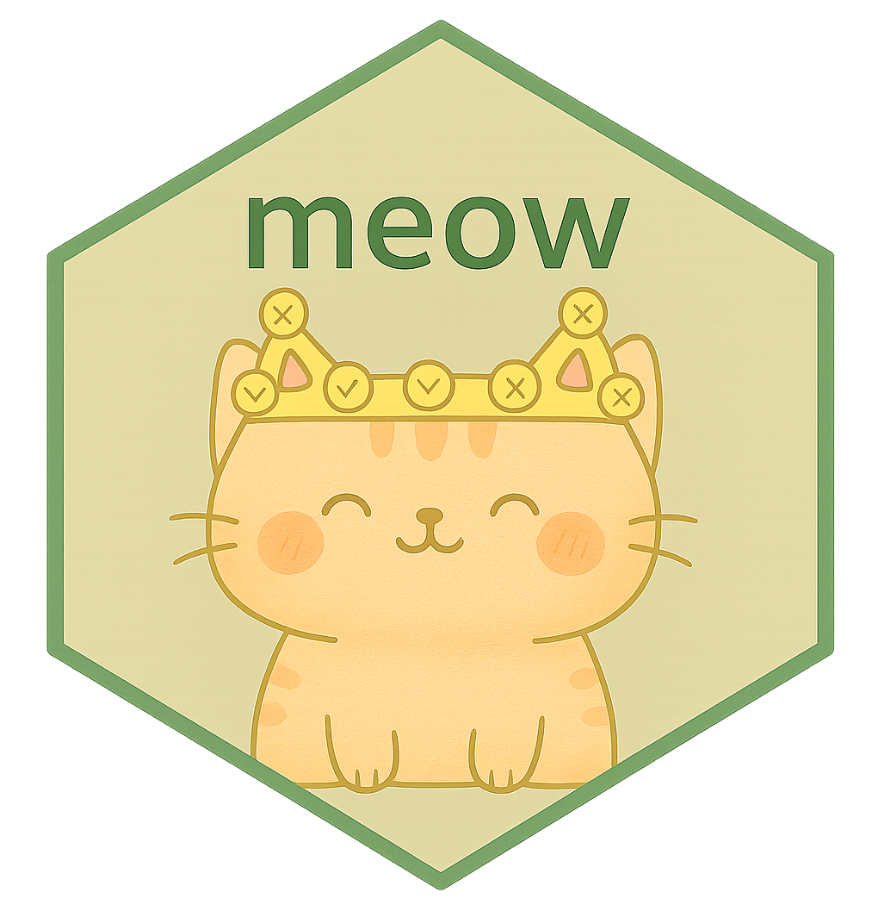

# meow <a href="http://klintkanopka.com/meow/"></a>

[](https://joss.theoj.org/papers/eb37b6968301b54bc93feb7d0021753c)


`meow` is a package for conducting simulations of computer adaptive testing (CAT). The pitch here is that `meow` is a framework that facilitates reproducible comparisons between different combinations of data generating processes (DGPs), item selection algorithms, and parameter update algorithms.

We do this by functionalizing these components as treating them modular for use in a core simulation harness that produces consistent outputs with some `ggplot2`-based visualization tools. The goal is to expose the structure of these component functions to the user, allowing them to implement their own custom DGPs, selection algorithms, and update algorithms.

Users are also encouraged to contribute function modules associated with their research projects, facilitating more community interaction.

## Installation

Interested users can install using:

```
# install.packages("remotes")
remotes::install_github("klintkanopka/meow")
```
