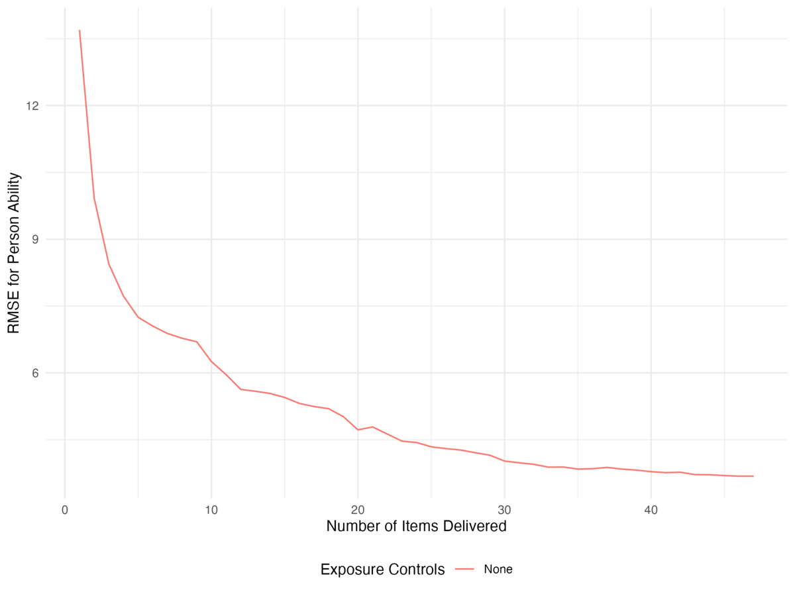
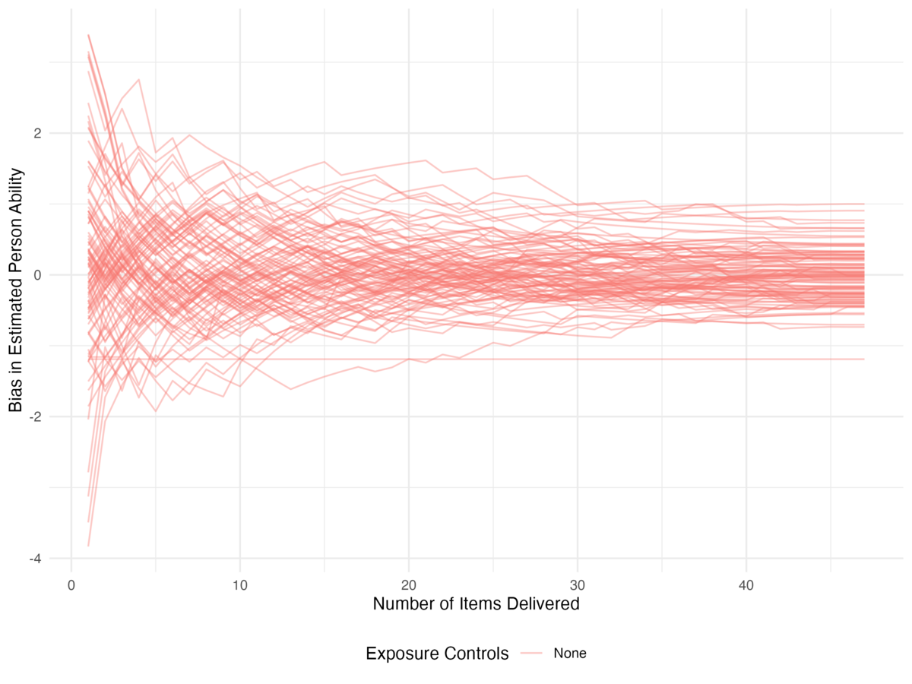
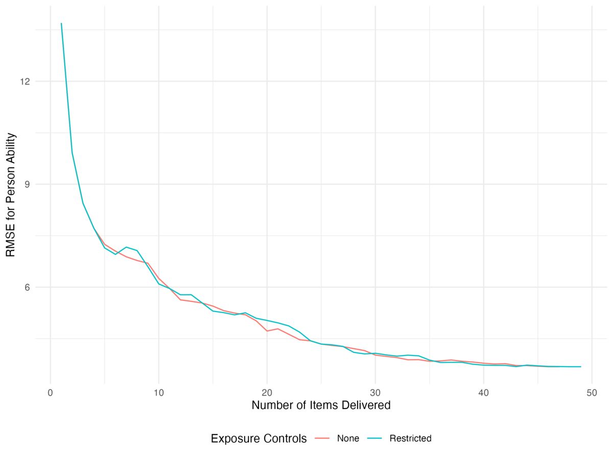
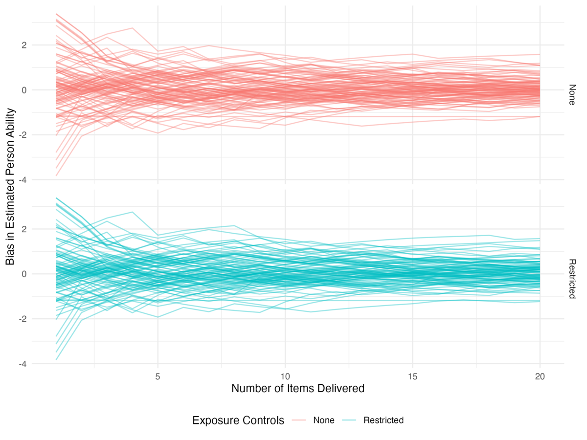

# The \`meow\` Workflow: Visualizing Exposure Control Methods

This vignette shows off the `meow` framework by walking through running
two simulations, one with no item exposure controls and one with item
exposure controls. The goal here is examining the workflow, examining
the data objects, and showing some possible visualization pathways. We
use `ggplot2` for the plots and `dplyr`/`tidyr` for reshaping; the
figures here are pre-rendered so the packages are not required to build
the vignette.

``` r

# remotes::install_github("klintkanopka/meow")
library(meow)
library(tidyverse)
```

## No exposure controls

First, we’ll set up the simulation with no exposure controls. This
requires we select a data loader that defines the simulation data
generating process. For a baseline, we’ll just use the built-in
[`data_simple_1pl()`](https://klintkanopka.com/meow/reference/data_simple_1pl.md).
Next, we need to decide how items are selected. Here we use the built-in
[`select_max_info()`](https://klintkanopka.com/meow/reference/select_max_info.md)
that picks the next item to maximize Fisher information. Finally, we
need an ability update function, and we use
[`update_theta_mle()`](https://klintkanopka.com/meow/reference/update_theta_mle.md)
to treat item parameters are fixed and pre-calibrated and estimate
ability after each iteration using maximum likelihood estimation:

``` r

out_none <- meow(
  select_fun = select_max_info,
  update_fun = update_theta_mle,
  data_loader = data_simple_1pl,
  init = NULL,
  fix = "item"
)
```

### RMSE of person abilities

After running, we have the `out_none` object, which is a list with a few
different components. First, the `$results` object is dataframe has one
row per iteration, with an estimate and a bias column for every
parameter in the simulation, allowing users to track how estimates
evolve over the test. Given that we work with simulated data, we can use
this to look at the RMSE in ability estimation as a function of the
number items administered.

``` r

results_none <- out_none$results |>
  mutate(control = "None")
```

``` r

results_none |>
  select(iter, control, starts_with("pers_")) |>
  select(iter, control, ends_with("_bias")) |>
  pivot_longer(ends_with("_bias"), names_to = "person", values_to = "bias") |>
  group_by(iter, control) |>
  summarize(rmse = sqrt(mean(bias^2)), .groups = "drop") |>
  ggplot(aes(x = iter, y = rmse, color = control)) +
  geom_line() +
  labs(x = "Number of Items Delivered", y = "RMSE for Person Ability",
       color = "Exposure Controls") +
  theme_minimal() +
  theme(legend.position = "bottom")
```



Figure 1

Individual ability bias trajectories may also be of interest:

``` r

results_none |>
  select(iter, control, starts_with("pers_")) |>
  select(iter, control, ends_with("_bias")) |>
  pivot_longer(ends_with("_bias"), names_to = "person", values_to = "bias") |>
  ggplot(aes(x = iter, y = bias, color = control, group = person)) +
  geom_line(alpha = 0.4) +
  labs(x = "Number of Items Delivered", y = "Bias in Estimated Person Ability",
       color = "Exposure Controls") +
  theme_minimal() +
  theme(legend.position = "bottom")
```



Figure 2

## Restricting item exposure

To add a simple exposure control, we write a custom item selection
function; this (hopefully easy) expandability is a core feature of
`meow` and a key part of its intended use. To enable this, we’ll use
another object exposed to the user: the item-item adjacency matrix. This
keeps track of how many times pairs of items have been exposed to the
same respondent. Importantly here, the diagonal of the adjacency matrix
holds each item’s total exposure count. Our approach will be to convert
that to an exposure *rate* and refuse to administer items whose rate
exceeds some user-specified `r_max`, choosing the most informative item
among those that remain.[^1]

``` r

select_restrict_rate <- function(pers, item, R, admin, adj_mat = NULL, r_max = 0.025) {
  # if no items have been administered, give the first five to everyone
  if (!any(admin != 0)) {
    admin[, seq_len(min(5, ncol(admin)))] <- 1L
    return(admin)
  }

  # compute an exposure rate for every item
  exposures <- diag(adj_mat)
  r_obs <- exposures / sum(exposures)
  allowed <- which(r_obs < r_max)

  # 2PL information for every respondent-item combination; column-major
  # recycling avoids materializing extra matrices (matching the package internals)
  n <- nrow(R)
  lin <- (pers$theta - rep(item$b, each = n)) * rep(item$a, each = n)
  p <- stats::plogis(lin)
  info <- matrix(p * (1 - p) * rep(item$a^2, each = n), nrow = n)

  for (i in which(rowSums(admin == 0) > 0)) {
    candidates <- intersect(which(admin[i, ] == 0), allowed)
    if (length(candidates) == 0) next            # no permitted items remain
    admin[i, candidates[which.max(info[i, candidates])]] <- 1L
  }
  admin
}
```

This selector ships with `meow` as
[`select_restrict_rate()`](https://klintkanopka.com/meow/reference/select_restrict_rate.md),
so you can use it without defining it yourself; we reproduce it here to
show how little code an exposure control takes. We can now conduct a
simulation as before, passing a non-default exposure rate through
`select_args`. The modular design ensures the other components of the
simulation remain as before, giving comparability between runs.

``` r

out_rest <- meow(
  select_fun = select_restrict_rate,
  update_fun = update_theta_mle,
  data_loader = data_simple_1pl,
  init = NULL,
  fix = "item",
  select_args = list(r_max = 0.02)
)
```

Now let’s compare RMSE across the two conditions:

``` r

results_rest <- out_rest$results |>
  mutate(control = "Restricted")

results <- bind_rows(results_none, results_rest)

results |>
  select(iter, control, starts_with("pers_")) |>
  select(iter, control, ends_with("_bias")) |>
  pivot_longer(ends_with("_bias"), names_to = "person", values_to = "bias") |>
  group_by(iter, control) |>
  summarize(rmse = sqrt(mean(bias^2)), .groups = "drop") |>
  ggplot(aes(x = iter, y = rmse, color = control)) +
  geom_line() +
  labs(x = "Number of Items Delivered", y = "RMSE for Person Ability",
       color = "Exposure Controls") +
  theme_minimal() +
  theme(legend.position = "bottom")
```



Figure 3

``` r

results |>
  select(iter, control, starts_with("pers_")) |>
  select(iter, control, ends_with("_bias")) |>
  pivot_longer(ends_with("_bias"), names_to = "person", values_to = "bias") |>
  filter(iter <= 20) |>
  ggplot(aes(x = iter, y = bias, color = control, group = person)) +
  geom_line(alpha = 0.4) +
  facet_grid(control ~ .) +
  labs(x = "Number of Items Delivered", y = "Bias in Estimated Person Ability",
       color = "Exposure Controls") +
  theme_minimal() +
  theme(legend.position = "bottom")
```



Figure 4

## Visualizing the adjacency matrix

One object in `meow` that’s odd (but powerful) is the adjacency matrix.
At the end of a simulation, a list of these is kept in the output object
if you want to look at how item exposure evolves over time. The
structure of the list of adjacency matrices returned in `$adj_mats` is
designed to make it easy to build dynamic network visualizations of item
utilization with `statnet` and `ndtv`.

``` r

library(statnet)
library(ndtv)

rest_nets <- lapply(out_rest$adj_mats, network)
dyn_rest <- networkDynamic(network.list = rest_nets)

render.d3movie(
  dyn_rest,
  usearrows = FALSE,
  main = "Maximum Fisher Information Item Selection",
  vertex.cex = abs(out_rest$item_tru$b),
  vertex.col = ifelse(out_rest$item_tru$b < 0, "dodgerblue", "tomato")
)
```

[^1]: Note that `r_max` here is compared against each item’s share of
    *all* administrations (the exposure counts sum to one across items),
    so the average item rate is `1 / N_items`. When `candidates` is
    empty for a respondent, the
    [`next`](https://rdrr.io/r/base/Control.html) simply skips them for
    that iteration and they are retried later; only if *every* remaining
    respondent is skipped in the same iteration does the simulation
    administer nothing new and stop, so
    [`select_restrict_rate()`](https://klintkanopka.com/meow/reference/select_restrict_rate.md)
    doubles as an implicit stopping rule. The practical consequence is
    that with `r_max` comfortably above `1 / N_items` the cap rarely
    matters. When `r_max` is near `1 / N_items`, it triggers only
    temporarily (exposure rates will eventually drop below `r_max` and
    every respondent eventually still sees the full item pool). When
    `r_max` is below `1 / N_items` this will induce early stopping,
    ending tests early with respondents seeing only a subset of the full
    item pool.
